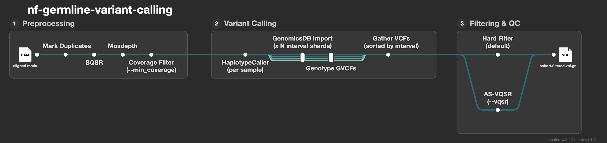

# nf-germline-variant-calling

A Nextflow DSL2 pipeline for GATK4 best-practices germline variant calling from whole-genome sequencing data.

> Originally developed and validated on the CPTAC LUAD cohort during MSc thesis research; this public version runs against GIAB reference samples for reproducibility.

---

## Pipeline overview



```
BAM input (per sample)
    |
    v
Normalize            - coordinate-sort, ensure a read group, index
    |
    v
MarkDuplicates       - flag PCR and optical duplicates
    |
    v
BQSR                 - recalibrate base quality scores
    |
    v
mosdepth             - coverage QC; samples below --min_coverage are excluded
    |
    v
HaplotypeCaller      - call variants in GVCF mode (per sample, AS annotations)
    |
    v
[collect all GVCFs, scatter by interval shard]
    |
    v
GenomicsDBImport     - merge GVCFs per interval shard (parallelised)
    |
    v
GenotypeGVCFs        - joint genotyping per interval shard (parallelised)
    |
    v
GatherVcfs           - merge per-shard VCFs into a single cohort VCF
    |
    v
Variant filtering    - hard filtering (default) or AS-VQSR (--vqsr, large cohorts)
    |
    v
Final QC             - ValidateVariants, sites-only VCF, bcftools stats
    |
    v
cohort.filtered.vcf.gz
```

---

## Example run

A complete end-to-end run on the HG002 chr20 demo (AWS Batch) is captured in [`example_output/`](example_output/):

- **[`report.html`](example_output/report.html)** - Nextflow execution report (per-process resources, timing, and status)
- **[`timeline.html`](example_output/timeline.html)** - execution timeline
- **`HG002.mosdepth.summary.txt`** - coverage QC over the calling regions (chr20 mean ~271x)
- **`cohort.filtered.stats.txt`** - `bcftools stats` on the final VCF (112,888 SNPs, 22,206 indels)
- **`cohort.filtered.head.vcf`** - the final cohort VCF, truncated to the header plus the first variant records

These are small, curated artifacts; the full VCFs, GVCFs, and BAMs are regenerable by running the pipeline.

---

## Requirements

- [Nextflow](https://www.nextflow.io/) >= 23.04
- [Docker](https://www.docker.com/)
- Java 11 or later (required by Nextflow)

---

## Quick start

**Small cohort / demo (hard filtering):**

```bash
nextflow run main.nf \
  -profile local \
  --input   sample_sheet.tsv \
  --ref     /path/to/GRCh38.fa \
  --outdir  results \
  --dbsnp   /path/to/dbsnp138.vcf.gz \
  --mills   /path/to/mills.vcf.gz \
  --onekg   /path/to/1000G_phase1.snps.hg38.vcf.gz \
  --intervals_dir /path/to/scattered_intervals/
```

**Large cohort with AS-VQSR (>=30 samples recommended):**

```bash
nextflow run main.nf \
  -profile aws \
  -w s3://your-bucket/work \
  --input   s3://your-bucket/inputs/sample_sheet.tsv \
  --ref     s3://your-bucket/ref/GRCh38.fa \
  --outdir  s3://your-bucket/results \
  --dbsnp   s3://your-bucket/known-sites/dbsnp138.vcf.gz \
  --mills   s3://your-bucket/known-sites/mills.vcf.gz \
  --onekg   s3://your-bucket/known-sites/1000G_phase1.snps.hg38.vcf.gz \
  --hapmap  s3://your-bucket/known-sites/hapmap_3.3.hg38.vcf.gz \
  --omni    s3://your-bucket/known-sites/1000G_omni2.5.hg38.vcf.gz \
  --intervals_dir s3://your-bucket/intervals/ \
  --vqsr
```

`--hapmap` and `--omni` are required when `--vqsr` is set; they are the truth/training resources for the SNP recalibration model.

---

## Input

### Sample sheet

Tab-separated, with header. One row per sample.

```
sample_id	bam
HG001	/path/to/HG001.bam
HG002	/path/to/HG002.bam
HG003	/path/to/HG003.bam
```

BAI index files must exist alongside each BAM (`<bam>.bai`).

### Reference files

| File | Description | Required |
|------|-------------|----------|
| `--ref` | GRCh38 reference FASTA (must have `.fai` and `.dict`) | Yes |
| `--dbsnp` | `Homo_sapiens_assembly38.dbsnp138.vcf.gz` | Yes |
| `--mills` | `Mills_and_1000G_gold_standard.indels.hg38.vcf.gz` | Yes |
| `--onekg` | `1000G_phase1.snps.high_confidence.hg38.vcf.gz` | Yes |
| `--hapmap` | `hapmap_3.3.hg38.vcf.gz` | AS-VQSR only |
| `--omni` | `1000G_omni2.5.hg38.vcf.gz` | AS-VQSR only |

All GATK resource bundle files are available from the [Broad public bucket](https://console.cloud.google.com/storage/browser/genomics-public-data/resources/broad/hg38/v0).

### Scatter intervals

The pipeline scatters GenomicsDBImport and GenotypeGVCFs across interval shards. Generate them once with:

```bash
gatk SplitIntervals \
  -R GRCh38.fa \
  --scatter-count 100 \
  -O intervals/
```

Then pass the output directory with `--intervals_dir intervals/`. For the single-chromosome demo, a single interval list covering that chromosome is sufficient.

---

## Parameters

| Parameter | Default | Description |
|-----------|---------|-------------|
| `--input` | *required* | Path to sample sheet TSV |
| `--ref` | *required* | Path/URI to reference FASTA |
| `--outdir` | `results` | Output directory |
| `--dbsnp` | *required* | dbSNP VCF |
| `--mills` | *required* | Mills indels VCF |
| `--onekg` | *required* | 1000G SNPs VCF |
| `--hapmap` | - | HapMap VCF (AS-VQSR only) |
| `--omni` | - | Omni VCF (AS-VQSR only) |
| `--intervals_dir` | *required* | Directory of scattered `.interval_list` files |
| `--vqsr` | `false` | Use AS-VQSR instead of hard filtering |
| `--min_coverage` | `10` | Minimum mean coverage over the calling regions; samples below this are excluded before variant calling |
| `--optical_dup_pixel_dist` | `2500` | `2500` for patterned flowcells (NovaSeq); `100` for unpatterned |

---

## Profiles

| Profile | Executor | Use case |
|---------|----------|----------|
| `local` | Local machine | Development and testing |
| `aws` | AWS Batch | Production runs |

```bash
# Run locally
nextflow run main.nf -profile local ...

# Run on AWS Batch
nextflow run main.nf -profile aws ...
```

---

## AWS deployment

The `aws` profile reads deployment-specific settings from environment variables, so no account details live in the repo. Build and push the tool images to your own ECR once:

```bash
bash docker/build_and_push.sh
```

Then set these before running with `-profile aws`:

```bash
export NF_ECR_REGISTRY=<account>.dkr.ecr.<region>.amazonaws.com
export NF_BATCH_QUEUE=<your-batch-queue>
export NF_BATCH_JOB_ROLE=arn:aws:iam::<account>:role/<your-batch-job-role>
export AWS_REGION=us-east-1   # optional; defaults to us-east-1
```

Any of these can also be passed on the command line (e.g. `--batch_queue ...`). Missing values fail fast with a clear error. The S3 bucket is supplied per run via `-w` and the `--input`/`--ref`/`--outdir` paths.

---

## Output

```
results/
├── markdup/
│   ├── HG002.markdup.bam
│   ├── HG002.markdup.bai
│   └── HG002.markdup_metrics.txt
├── bqsr/
│   ├── HG002.bqsr.bam
│   └── HG002.bqsr.bai
├── qc/
│   ├── HG002.mosdepth.summary.txt
│   ├── HG002.mosdepth.global.dist.txt
│   └── HG002.mosdepth.quantized.bed.gz
├── gvcfs/
│   ├── HG002.g.vcf.gz
│   └── HG002.g.vcf.gz.tbi
├── genotyped/
│   ├── 0000-scattered.genotyped.vcf.gz
│   └── 0000-scattered.genotyped.vcf.gz.tbi
└── filtered/
    ├── cohort.raw.vcf.gz
    ├── cohort.raw.vcf.gz.tbi
    ├── cohort.filtered.vcf.gz
    ├── cohort.filtered.vcf.gz.tbi
    ├── cohort.filtered.sites_only.vcf.gz
    ├── cohort.filtered.sites_only.vcf.gz.tbi
    └── cohort.filtered.stats.txt
```

GenomicsDB workspaces are intermediate and not copied to the output directory.

---

## Demo dataset

The public demo runs on a single [GIAB](https://www.nist.gov/programs-projects/genome-bottle) sample, HG002 (chr20 only), sourced from the public GIAB S3 bucket. GIAB provides NIST-validated truth variant sets for benchmarking.

For a multi-sample joint-calling run, HG001, HG002, and HG003 full-genome BAMs are available on the public GIAB S3 bucket at `s3://giab/`.

---

## Containers

All processes run in pinned Docker images. No local tool installation required beyond Nextflow and Docker. The `aws` profile uses ECR copies of these images with the AWS CLI added for S3 staging, built via `docker/build_and_push.sh`.

| Process | Image |
|---------|-------|
| MarkDuplicates, BQSR, HaplotypeCaller, GenomicsDBImport, GenotypeGVCFs, GatherVcfs, VQSR, HardFilter, ValidateVcf | `broadinstitute/gatk:4.5.0.0` |
| mosdepth | `quay.io/biocontainers/mosdepth:0.3.8--hd299d5a_0` |
| VcfStats | `quay.io/biocontainers/bcftools:1.18--h8b25389_0` |
